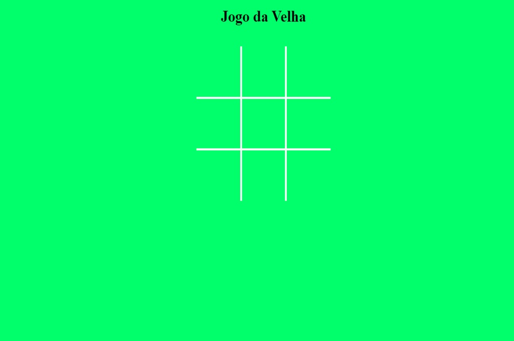

# Jogo da Velha

Link do site:  https://kaiocesarnp.github.io/jogodavelha/

O jogo da velha ou jogo do galo é um jogo e/ou passatempo popular. É um jogo de regras extremamente simples, que não traz grandes dificuldades para seus jogadores e é facilmente aprendido.

Estrutura e estilo do site em HTML e CSS; implementação em JavaScript. 

Jogo feito para duas pessoas,  que jogam alternadamente, preenchendo cada um dos espaços vazios. Cada participante deve usar um símbolo (X ou O). Vence o jogador que conseguir formar primeiro uma linha com três símbolos iguais, seja ela na horizontal, vertical ou diagonal. Código comentado e site responsivo.

